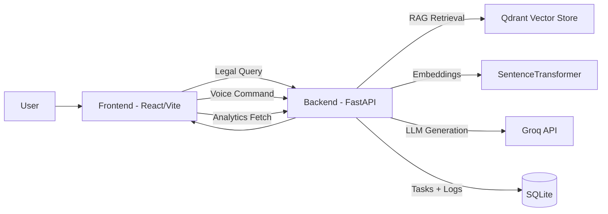

# AI Productivity Suite

Full-stack AI project that combines:

- a **Legal RAG Assistant** for BNS-focused question answering
- a **Voice Task Manager** that executes natural-language commands
- a **dual analytics dashboard** with separate Legal and Voice KPI tabs

Built to demonstrate practical AI engineering, product thinking, and clean full-stack execution.

---

## Why This Project

Most demos either show a chatbot or a task manager in isolation.  
This project integrates both into one coherent product:

- **Legal AI workflow**: retrieval + generation + reliability safeguards + analytics
- **Voice workflow**: intent parsing + action execution + ambiguity handling + analytics
- **UX workflow**: responsive UI, glassmorphism design system, and visual dashboarding

---

## What Was Achieved

- Implemented end-to-end **RAG pipeline** over legal content (Qdrant + embeddings + Groq inference).
- Built **voice intent/action engine** supporting `create`, `complete`, `cancel`, `delay`, `query`.
- Added **error/fallback behavior** for empty legal answers and low-confidence voice parsing.
- Created **analytics separation**: Legal metrics and Voice metrics are isolated and tabbed.
- Upgraded UI with a premium visual system (animated gradient backgrounds + glass cards).
- Prepared project for GitHub showcase with clean docs and structure.

---

## System Architecture



### Backend Modules

- `backend/main.py`: API routes, task logic, legal/voice analytics, persistence.
- `backend/rag.py`: retrieval, context building, answer generation.
- `backend/ingest_chunks.py` + `backend/new_docling.py`: legal document ingestion pipeline.

### Frontend Modules

- `frontend/src/pages/Dashboard.tsx`: landing experience and navigation.
- `frontend/src/pages/LegalChatbot.tsx`: legal assistant chat interface.
- `frontend/src/pages/VoiceTaskApp.tsx`: speech/text command workflow + task state.
- `frontend/src/pages/Analysis.tsx`: tabbed analytics (`Legal` / `Voice`).

---

## Feature Breakdown

## 1) Legal Assistant (RAG)

- Ask legal questions from BNS context.
- Vector retrieval from Qdrant + section-aware context construction.
- Structured answer generation with citations.
- Request outcomes logged for dashboard KPIs.

Primary APIs:
- `POST /api/legal-chat`
- `GET /api/legal-analytics`
- `POST /api/legal-analytics/seed`

## 2) Voice Task Manager

- Voice/text natural language commands.
- Intent detection and execution in one call.
- Supported actions:
  - `create`
  - `complete`
  - `cancel`
  - `delay`
  - `query`
- Ambiguity handling (multiple task matches), warnings, and action history metrics.

Primary APIs:
- `POST /api/voice/parse` (preview only)
- `POST /api/voice/action` (execute)
- `GET /api/voice/mock-questions`
- `GET /api/voice-analytics`
- `POST /api/voice-analytics/seed`

## 3) Analytics Dashboard

- Dedicated tabs:
  - **Legal Analytics**
  - **Voice Task Analytics**
- Includes:
  - KPI cards
  - weekly trend line chart
  - status/result distribution pie chart
  - topic/action bar chart

---

## Tech Stack

### Frontend
- React 19
- TypeScript
- Vite
- Tailwind CSS
- Recharts
- Framer Motion
- Three.js (animated shader background)

### Backend
- FastAPI
- SQLAlchemy
- SQLite
- Qdrant
- SentenceTransformers
- Groq (OpenAI-compatible API)
- python-dotenv

---

## Run Locally

### 1) Backend

```bash
cd backend
pip install -r requirements.txt
python -m uvicorn main:app --reload --port 8000
```

### 2) Frontend

```bash
cd frontend
npm install
npm run dev
```

- Frontend: `http://localhost:5173`
- Backend: `http://127.0.0.1:8000`

---

## Project Structure

```text
ai-project-mock/
  backend/                    # FastAPI app + RAG + voice + analytics
    main.py
    rag.py
    ingest_chunks.py
    new_docling.py
  frontend/                   # React client app
    src/pages/
      Dashboard.tsx
      LegalChatbot.tsx
      VoiceTaskApp.tsx
      Analysis.tsx
  docs/screenshots/
  README.md
```

---

## Screenshots


---

## Recruiter Notes

This project demonstrates:

- full-stack ownership (UI + APIs + data + integration)
- applied LLM engineering (RAG + intent extraction + fallback logic)
- analytics-driven product thinking
- debugging under real runtime issues (process conflicts, payload normalization, API consistency)

---

## Security and Ops Notes

- Keep secrets only in `.env` (never commit keys).
- Rotate exposed API keys before sharing publicly.
- If `8000` is busy, stop stale Python/Uvicorn processes before restart.
